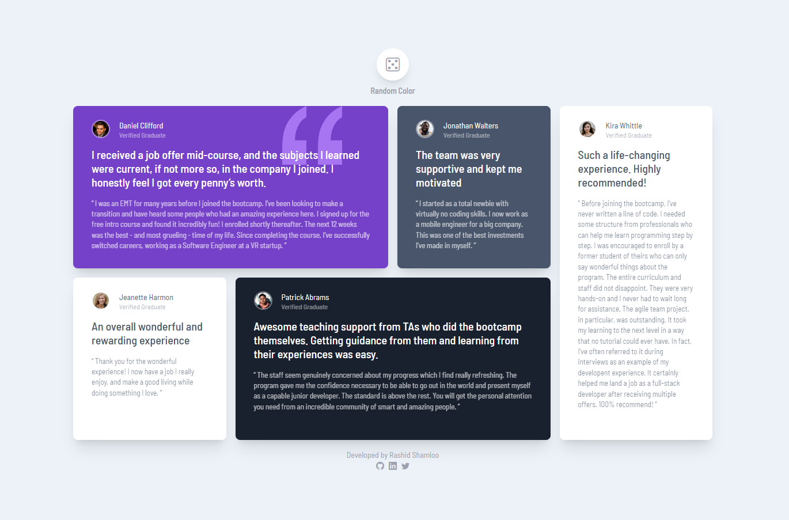

# Front End Mentor - Project 026 - Testimonials Grid Section

This is a solution to the [Testimonials Grid Section challenge on Frontend Mentor](https://www.frontendmentor.io/challenges/testimonials-grid-section-Nnw6J7Un7).

## Table of contents

- [Overview](#overview)
  - [Screenshot + Video](#screenshot--video)
  - [Links](#links)
- [My process](#my-process)
  - [Built with](#built-with)
  - [What I learned](#what-i-learned)
  - [Useful resources](#useful-resources)
- [Author](#author)

## Overview

### Screenshot + Video

- Desktop

https://user-images.githubusercontent.com/121501991/224519048-ea4e9f90-093b-4b96-9f42-991f26ffe952.mp4

- Mobile

### Links

- Solution URL: https://github.com/rashidshamloo/fem_026_testimonials-grid-section/
- Live Site URL: https://rashidshamloo.github.io/fem_026_testimonials-grid-section/

## My process

### Built with

- Vite / React
- Tailwind CSS
- Semantic HTML5 markup

### What I learned

- Using different grid properties in Tailwind CSS
- Adding `grid-template-areas` to Tailwind CSS with a plugin and using it
- Making changes to the grid layout based on different breakpoints
- Force updating React components when needed
- Writing and using utility functions in React
- Using `sr-only` class in Tailwind CSS for accessibility

### Useful resources

- [Grid Areas for Tailwind CSS](https://savvywombat.com.au/tailwind-css/grid-areas/) - The grid area plugin for Tailwind CSS that i used

## Author

- Frontend Mentor - [@rashidshamloo](https://www.frontendmentor.io/profile/rashidshamloo)
- Twitter - [@rashidshamloo](https://www.twitter.com/rashidshamloo)
